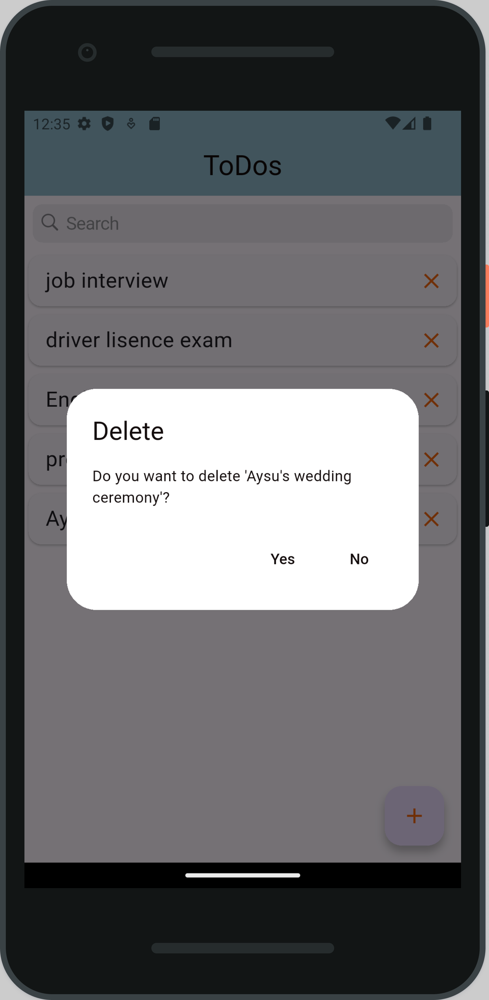

# ✅ Flutter ToDo App

## EN:
This project is a simple **ToDo application** developed with **Flutter**.  
It uses **BLoC (Cubit)** architecture for state management and **SQLite** for database operations.

---

## 📱 Application Features

- 📝 **List** tasks  
- ➕ **Add** new tasks  
- ✏️ **Update** existing tasks  
- ❌ **Delete** tasks  
- 💾 Persistent data storage with **SQLite**  
- ⚙️ Clean and manageable state management with **Cubit**

---

## 🧱 Technologies Used

- **Flutter** – UI development  
- **flutter_bloc** – Cubit/BLoC architecture  
- **Sqflite** – Local database  

---

## TR: 
Bu proje, Flutter ile geliştirilmiş basit bir **ToDo uygulamasıdır**.  
Durum yönetiminde **BLoC (Cubit)** mimarisi, veritabanı işlemlerinde ise **SQLite** kullanılmıştır.

---

## 📱 Uygulama Özellikleri

- 📝 Görevleri **listeleme**
- ➕ Yeni görev **ekleme**
- ✏️ Görev **güncelleme**
- ❌ Görev **silme**
- 💾 **SQLite** ile kalıcı veri saklama
- ⚙️ **Cubit** ile temiz ve yönetilebilir durum yönetimi

---

## 🧱 Kullanılan Teknolojiler

- **Flutter** – UI geliştirme
- **flutter_bloc** – Cubit/BLoC mimarisi
- **Sqflite** – Yerel veritabanı

---

## 📸 Project Preview:

  
  
  
  

